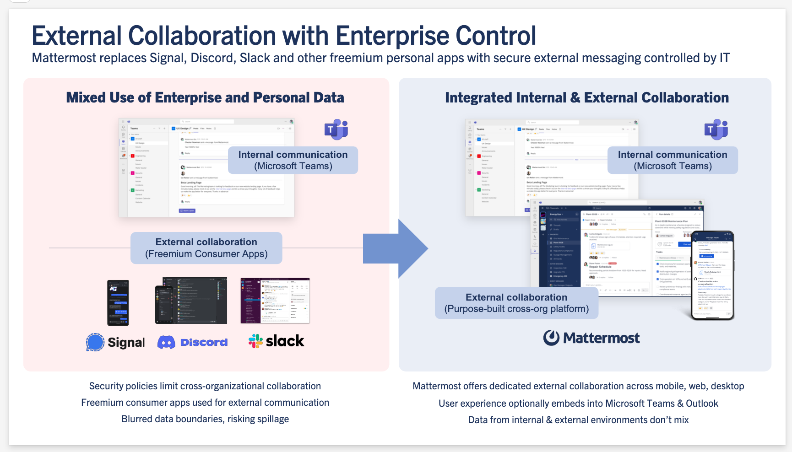

# Mattermost Mission Collaboration for Microsoft 365

**Mattermost Mission Collaboration for Microsoft** extends Microsoft Office365, Teams, and Outlook for mission-critical coordination, command and control, incident response, and DevSecOps workflows in demanding environments, including air-gapped and classified networks. 

> [!NOTE]  
> This product is currently in **Beta**. We're excited to share it with you and welcome your feedback to help us improve. While the core features are ready for use, you may encounter minor issues as we continue to refine the experience. Please share your thoughts and suggestions in the [~user-feedback](https://community.mattermost.com/core/channels/user-feedback) channel or submit an issue on [GitHub](https://github.com/mattermost/mattermost-plugin-msteams-devsecops/issues).

This repository provides the foundation for multiple Microsoft app offerings that integrate with the Mattermost platform. 

- **Mattermost Mission Collaboration for Microsoft**: Extend Enterprise communications to the Tactical Edge by accessing Mattermost from your Microsoft Office365, Teams, and Outlook user experiences. 
- **Community Mattermost for Microsoft 365 & MS Teams**: Free offering to explore Mattermost capabilities and meet with fellow end users, customers and evaluators, along with Mattermost staff. 

## Mattermost Mission Collaboration for Microsoft 365 & MS Teams

The **Mattermost Mission Collaboration for Microsoft** application extends Enterprise communications with secure external collaboration controlled by IT by accessing Mattermost from your Microsoft Office365, Teams, and Outlook user experiences.

**Benefits & Use Cases:**
- **External Collaboration with IT Control**: Replace non-compliant freemium personal apps with dedicated external collaboration across mobile, web, and desktop, fully controlled by IT.
- **Intelligent, AI-Accelerated Incident Response**: Augment Microsoft Security Suite with AI-powered collaborative workflows, from detection to resolution, within secure environments. 
- **Sovereign, Cyber-Resilient S4B Replacement for Classified Workflows**: Replace legacy Skype for Business with a self-hosted, fully sovereign solution for classified operations, tightly integrated within Microsoft ecosystems. 
- **Embedded DevSecOps Collaboration Inside Microsoft Teams**: Maintain a unified user experience while achieving higher operational productivity for DevSecOps and mission teams.
- **Mission Operations at the Tactical Edge**: Real-time command and control for joint operations, mission partner environments, and disconnected/denied environments (DDIL). 

**Features:**
- **Direct Access**: Access Mattermost directly from a tab without switching applications or opening a browser. 
- **Seamless Integration**: Experience the full functionality of Mattermost within a familiar Microsoft Teams interface. 
- **Real-time Collaboration**: Collaborate with your team on projects, workflows, and communications in real time. 
- **Unified Communications**: Combine chat, meetings, workflows, and task management inside MS Teams. 
- **Secure Data Handling**: Maintain data sovereignty with self-hosted deployment options. 
- **AI-Powered Insights**: Use multi-agent AI, including Azure OpenAI and local LLMs, for faster decision-making and situational awareness. 
- **Embedded DevSecOps Collaboration**: Keep developer teams productive with integrated workflows inside Microsoft Teams.
- **Entra-Based SSO**: Simplify user authentication and enhance security with enterprise-grade identity management for organizations using Microsoft Entra ID.
- **Activity Feed Notifications for Mentions in Mattermost**: Never miss critical updates, with real-time notifications in your MS Teams activity feed whenever someone mentions you in Mattermost.

This app is designed to work with Microsoft 365, Outlook, and Microsoft Teams.

### Admin Setup

For detailed setup instructions, see the [Setup Guide](./docs/admin_setup.md), which provides step-by-step instructions for creating and configuring a Microsoft Teams application in Azure.

### FAQ

#### Where can I get support?

You can browse existing open issues or submit a new issue for support in GitHub: https://github.com/mattermost/mattermost-teams-tab/issues

## Community Mattermost for Microsoft 365 & MS Teams

The *Community Mattermost for Microsoft 365* application provides a showcase and peer-to-peer discussion environment for Mattermost customers, open source users, and system evaluators.

Community Mattermost runs as an online service at https://community.mattermost.com and is made available in Microsoft Teams, Microsoft Outlook, and the Microsoft Application hosting environment with this offering.

**Capabilities:**
- Connect to the Mattermost Community environment as a Microsoft application from within Microsoft Teams and Outlook web and desktop environments.

**Benefits:**
- Seamlessly communicate with the Mattermost Community from Microsoft Teams and Outlook using application tabs.
- Evaluate a showcase deployment of Mattermost capabilities in consideration of self-hosting the platform within your Azure or on-prem environments.  
- Share input with Mattermost staff and developers on future improvements to the platform.

The following future capabilities are being considered for addition in upcoming releases:

- Integrated notifications across Mattermost and Microsoft Teams.
- Optional Single-Sign-On with integrated authentication.

**Key Features:**  
- **Direct Access**: Access the Mattermost Customer Community directly from a tab without switching applications or opening a browser.  
- **Seamless Integration**: Experience the full functionality of the Mattermost Customer Community within a familiar interface.  
- **Real-time Collaboration**: Engage with the Mattermost community in real-time discussions on product features, technical questions, and best practices.  
- **Professional Support**: Licensed customers can get help from Mattermost staff.
- **Peer-to-Peer Q&A**: All customers and users of Mattermost free and open source editions can get peer-to-peer help and input at no cost.
- **Contribute to Development**: Participate in discussions that shape the future direction of Mattermost products.  
- **Knowledge Sharing**: Learn implementation strategies and best practices from a diverse community of users.  
- **Stay Updated**: Keep up with the latest Mattermost announcements, updates, and roadmap information.  

This app is designed to work with Microsoft 365, Outlook, and Microsoft Teams. A free account is required to use the Mattermost Customer Community.  

**About Mattermost:**  
Mattermost is a purpose-built platform for technical and operational teams in organizations vital to national security, public safety, and critical infrastructure. [https://mattermost.com/](https://mattermost.com/)   

### End User Setup

Any Microsoft 365 user can complete the steps below to access Mattermost for Microsoft 365 within their Microsoft environment, provided their organization allows users to install apps from the App Store:
1. Sign in to your Microsoft Teams account [from a web browser](https://teams.microsoft.com/v2/?clientexperience=t2) or the desktop application.
2. Select the [+] Apps button in the Teams sidebar.
3. Search for Mattermost for Microsoft 365 and then select Add to install the application.
4. (Optional) Pin the Mattermost app to your Teams sidebar by right-clicking on it and selecting Pin.
5. Once the Mattermost app is installed, you’ll be connected to the public Mattermost Community instance.

### Getting started

Once you’ve installed the app, here are some ways to get started:

- **Ask questions**: Use the [~ask-anything](https://community.mattermost.com/core/channels/ask-anything) channel to ask technical questions or get support from the community.
- **Contribute**: If you’re interested in contributing to Mattermost, join the [~developers](https://community.mattermost.com/core/channels/developers) channel to connect with other contributors.
- **Share feedback**: Your ideas and feedback are valuable. Share your thoughts in the [~user-feedback](https://community.mattermost.com/core/channels/user-feedback) channel.

### FAQ

#### Where can I get support?

You can browse existing open issues or submit a new issue for support in GitHub: https://github.com/mattermost/mattermost-teams-tab/issues

#### Do I need a Mattermost account to use this application?
Yes, you’ll need to create a free account on the Mattermost Community server when you first access it through the app.

