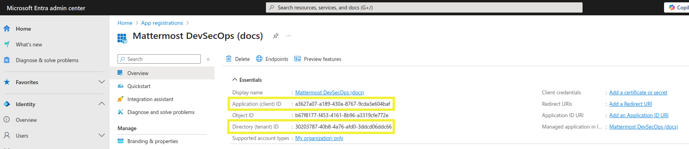
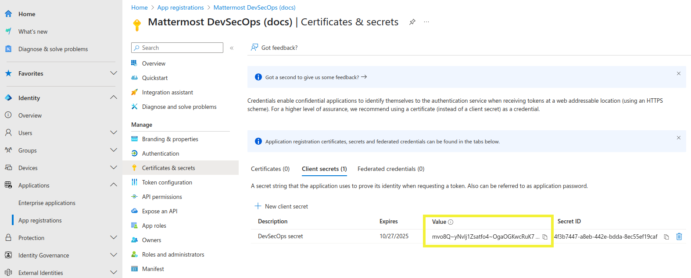
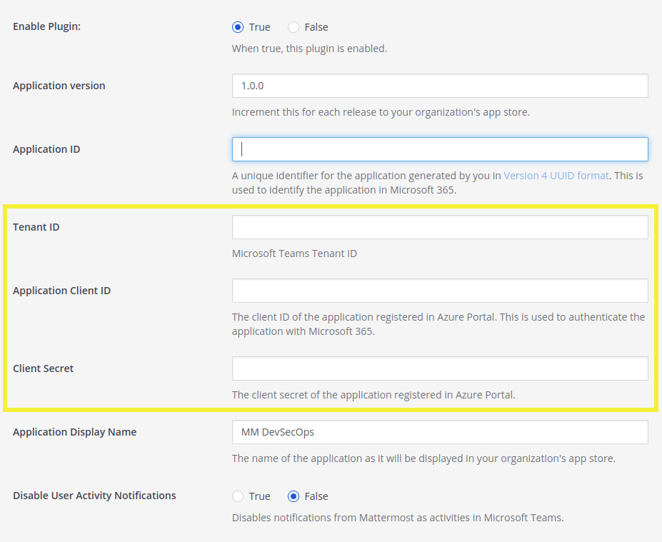
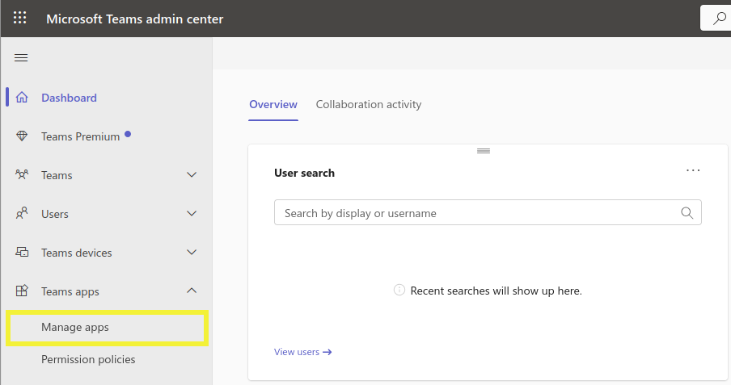

# Administrator Setup

## Create and setup a Teams application in Azure

1. Go to your **Azure Portal > Microsoft Entra ID**

2. Go to **App registrations**

3. Create a new app registration by clicking **Add > App registration**
    - Give it a name
    - Accounts in this organizational directory only (single tenant)
    - No redirect URIs

4. Go to your newly created application
    - Make note of these values as you'll need those later:
        - Application (client) ID → _Required in the plugin configuration_
        - Directory (tenant) ID → _Required for the plugin configuration_
            

5. Go to **Certificates and secrets**
    - Generate a new Client secret
    - Make note of the secret value → _Required in the plugin configuration_
        

6. Go to **API Permissions**
    - Ensure `User.Read` **delegated** permission is added ([Microsoft documentation](https://learn.microsoft.com/en-us/microsoftteams/platform/tabs/how-to/authentication/tab-sso-register-aad#enable-sso-in-microsoft-entra-id))
    - Add `TeamsActivity.Send` **application** permission (optional, for notifications) ([Microsoft documentation](https://learn.microsoft.com/en-us/graph/teams-send-activityfeednotifications?tabs=desktop%2Chttp))
    - Add `AppCatalog.Read.All` **application** permission. (optional, for notifications) ([Microsoft documentation](https://learn.microsoft.com/en-us/graph/api/appcatalogs-list-teamsapps?view=graph-rest-1.0&tabs=http))
    - Grant admin consent for the default directory to prevent users from seeing the consent prompt.

7. Go to **Expose an API**
    - Edit the "_Application ID URI_" as such: `api://{{Mattermost Site URL Hostname}}/{{Application (client) ID}}`
    - Add the `access_as_user` scope by clicking the "Add a scope" button. ([Microsoft documentation](https://learn.microsoft.com/en-us/microsoftteams/platform/tabs/how-to/authentication/tab-sso-register-aad#to-configure-api-scope))
        - **Scope name**: `access_as_user`
        - **Who can consent?** Admins and users
        - Provide a display name and description, as well as a user consent display name and description. These will be shown to end users on the consent screen.
            For example:
            **Display name**: Log in to Mattermost
            **Description**: Used to allow O365 users to log in to the Mattermost application 
            **User consent display name**: Log in to Mattermost
            **User consent description**: This permission is required to automatically log you in into Mattermost from Microsoft applications.
        - Add authorised client applications for the scope we just created ([Microsoft documentation](https://learn.microsoft.com/en-us/microsoftteams/platform/tabs/how-to/authentication/tab-sso-register-aad#to-configure-authorized-client-application))
            - Click on "_Add a client application_". **You need to add a client application per target Microsoft application you want**:
                - **Authorised scopes**: The one we just created
                - **Client ID**:
                    - **Teams web**: 5e3ce6c0-2b1f-4285-8d4b-75ee78787346
                    - **Teams app**: 1fec8e78-bce4-4aaf-ab1b-5451cc387264
                - If you want to make your application available in more Microsoft application, you need to keep adding client applications from [the following table](https://learn.microsoft.com/en-us/microsoftteams/platform/tabs/how-to/authentication/tab-sso-register-aad#to-configure-authorized-client-application:~:text=Select%20one%20of%20the%20following%20client%20IDs%3A).

## Setup the plugin in Mattermost

1. Download the latest release of the plugin from [here](https://github.com/mattermost/mattermost-plugin-msteams-devsecops/releases).

2. Install the plugin by following the normal plugin installation process. For detailed instructions, refer to steps 1 through 5 of [this guide](./install_plugin.md).

3. Go to your **Mattermost server's system console > Plugins > MSTeams DevSecOps**

4. Enter an Application Version. You can start with "1.0.0".

5. Generate an Application ID in version 4 UUID format and enter it in the Application ID field. [UUID Generator](https://www.uuidgenerator.net/) will create a random ID in the correct format.

6. Enter the values you noted earlier in the appropriate fields:
    

    - **Directory (tenant) ID**: The Directory (tenant) ID you noted from step 4
    - **Application (client) ID**: The Application (client) ID you noted from step 4
    - **Client Secret**: The secret value you generated in step 5

7. Enter an Application Display Name. This can be any name you choose, and will be how your application is named in the MS Teams app store.

8. Save the changes and enable the plugin.

9. Click the "Download Manifest" button. This will generate the MS Teams application as a ZIP file, containing the app manifest. Save this file as it will be used in the next steps.

## Install the application in MS Teams

1. Go to the [Microsoft Teams admin center](https://admin.teams.microsoft.com/dashboard).

2. Go to **Teams apps > Manage apps**.

3. Go to **Actions > Upload new app** (upper right corner of the Manage apps page).

4. Click **Upload** and select the ZIP file saved previously.

5. **Done!** 🎉 Your application is now available to users.
